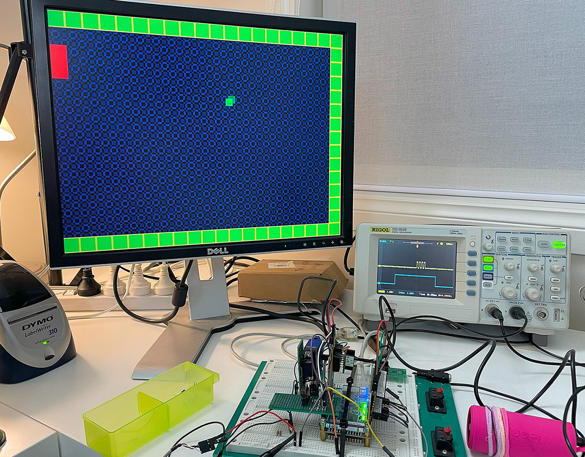

## How it works

This is a framebuffer-less VGA display generator (i.e. it is 'racing the beam') that implements a primitive Pong-like video game.

## How to test

You can find a full testing guide for the TT03p5 version here: https://github.com/algofoogle/tt03p5-solo-squash/blob/main/doc/testing.md

I plan on updating this, as this implementation will change the pinout a bit, if nothing else.

## External hardware

The main things this needs are:

*   A VGA DAC. TinyVGA will do. Actually, it's only RGB111 (1 bit per channel), so you don't even really need a DAC, just level shifters/buffers to 0.7V.
*   Speaker (e.g. piezo disc or "aux" input to a powered speaker).
*   Buttons for controlling the game.
